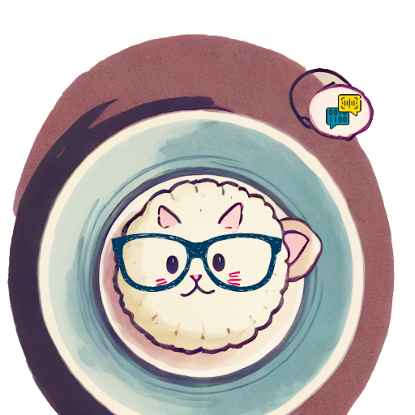

---
listing:
  contents: [posts]
  max-items: 5
  sort: "date desc"
  categories: false
  fields: [date, title, description, categories]
  feed: false
  filter-ui: false
  sort-ui: false
  date-format: MM-DD-YYYY
  exclude:
    title: "Posts"
comments: false
description: Recent posts
pagetitle: Nerdy Momo Cat
---

<h2 style="margin-bottom: 2rem !important">
Hi, I'm Nerdy Momo Cat
</h2>

::: me

:::

I'm passionate about all things personal knowledge management. I'm all about linking knowledge snippets, coding and automations, note taking and sketchnoting. 

Whether I'm helping others streamline their workflows and optimize their productivity, or experimenting with new tools to improve my own processes, I'm always exploring new ways to get the most out of my digital life.

My personal tools at the moment are: Notion, Todoist and Goodnotes, but I am always exploring other tools.

### Get in touch

Email me at [nerdymomocat\@gmail.com](mailto:nerdymomocat@gmail.com) or DM me on [Twitter](https://twitter.com/nerdymomocat) if you'd like to chat! 

I can create a personalized PKM (Personal Knowledge Management) system for you on an individual basis. If this is what you’re interested in, feel free to send me a direct message.

### Recent Posts