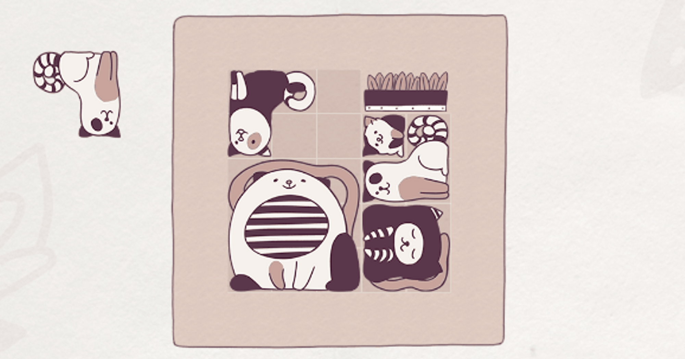
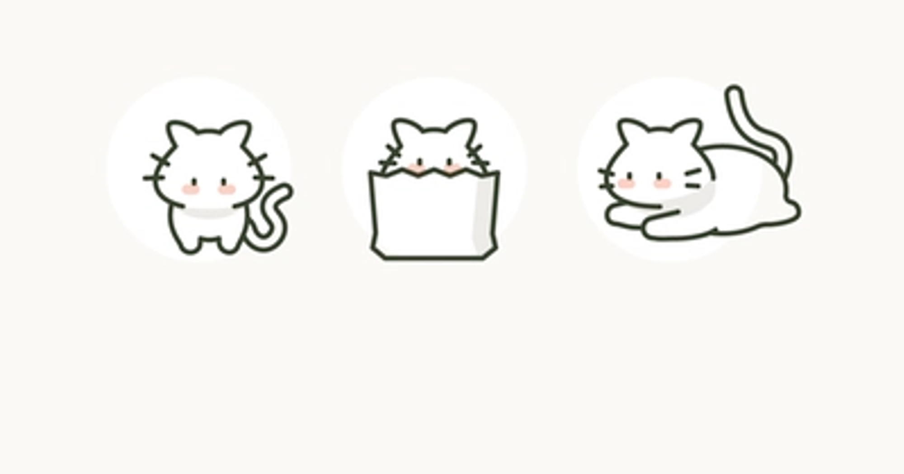
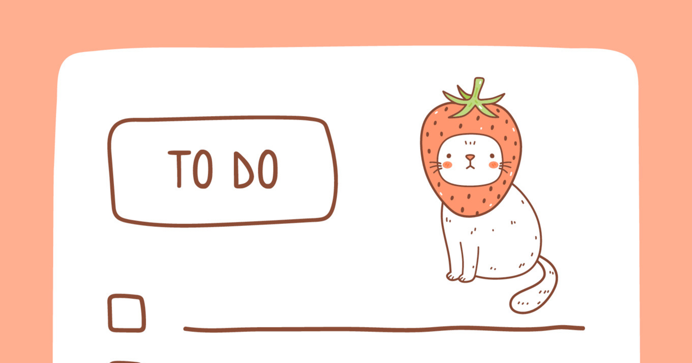

```{=html}
<div class="accordion">
   <div class="accordion-item">
      <h2 class="accordion-header no-anchor" style="
         margin-top: 0px;
         padding-bottom: 0px;
         ">
         <button class="accordion-button collapsed" type="button" data-bs-toggle="collapse" data-bs-target="#collapseOne" id="button-collapseOne">
         Filter by Themes
         </button>
      </h2>
      <div id="collapseOne" class="accordion-collapse collapse" data-bs-parent="#accordionExample" style="">
         <div class="accordion-body">
            <div class="grid" style="--bs-columns: 3;">
               <div>
                  <div class="card mb-3" style="max-width: 20rem;" onclick="window.quartoListingCategory('Notion'); document.getElementById('collapseOne').classList.remove('show'); document.getElementById('button-collapseOne').classList.add('collapsed'); return false;">
                     <div class="card-body">
                        
                     </div>
                     <div class="card-header">Notion</div>
                  </div>
               </div>
               <div>
                  <div class="card mb-3" style="max-width: 20rem;" onclick="window.quartoListingCategory('Todoist'); document.getElementById('collapseOne').classList.remove('show'); document.getElementById('button-collapseOne').classList.add('collapsed'); return false;">
                     <div class="card-body">
                        
                     </div>
                     <div class="card-header">Todoist</div>
                  </div>
               </div>
               <div>
                  <div class="card mb-3" style="max-width: 20rem;" onclick="window.quartoListingCategory('Apple Shortcuts'); document.getElementById('collapseOne').classList.remove('show'); document.getElementById('button-collapseOne').classList.add('collapsed'); return false;">
                     <div class="card-body">
                        
                     </div>
                     <div class="card-header">Apple Shortcuts</div>
                  </div>
               </div>
               <div>
                  <div class="card mb-3" style="max-width: 20rem;" onclick="window.quartoListingCategory('Capture'); document.getElementById('collapseOne').classList.remove('show'); document.getElementById('button-collapseOne').classList.add('collapsed'); return false;">
                     <div class="card-body">
                        
                     </div>
                     <div class="card-header">Capture</div>
                  </div>
               </div>
               <div>
                  <div class="card mb-3" style="max-width: 20rem;" onclick="window.quartoListingCategory('Organization'); document.getElementById('collapseOne').classList.remove('show'); document.getElementById('button-collapseOne').classList.add('collapsed'); return false;">
                     <div class="card-body">
                        
                     </div>
                     <div class="card-header">Organization</div>
                  </div>
               </div>
               <div>
                  <div class="card mb-3" style="max-width: 20rem;" onclick="window.quartoListingCategory('Design'); document.getElementById('collapseOne').classList.remove('show'); document.getElementById('button-collapseOne').classList.add('collapsed'); return false;">
                     <div class="card-body">
                        
                     </div>
                     <div class="card-header">Design</div>
                  </div>
               </div>
               <div>
                  <div class="card mb-3" style="max-width: 20rem;" onclick="window.quartoListingCategory('Reading'); document.getElementById('collapseOne').classList.remove('show'); document.getElementById('button-collapseOne').classList.add('collapsed'); return false;">
                     <div class="card-body">
                        
                     </div>
                     <div class="card-header">Reading</div>
                  </div>
               </div>
                <div>
                  <div class="card mb-3" style="max-width: 20rem;" onclick="window.quartoListingCategory('Tools'); document.getElementById('collapseOne').classList.remove('show'); document.getElementById('button-collapseOne').classList.add('collapsed'); return false;">
                     <div class="card-body">
                        
                     </div>
                     <div class="card-header">Tools</div>
                  </div>
               </div>
               <div>
                  <div class="card mb-3" style="max-width: 20rem;" onclick="window.quartoListingCategory('Tasks'); document.getElementById('collapseOne').classList.remove('show'); document.getElementById('button-collapseOne').classList.add('collapsed'); return false;">
                     <div class="card-body">
                        
                     </div>
                     <div class="card-header">Tasks</div>
                  </div>
               </div>
                <div>
                  <div class="card mb-3" style="max-width: 20rem;" onclick="window.quartoListingCategory('Automation'); document.getElementById('collapseOne').classList.remove('show'); document.getElementById('button-collapseOne').classList.add('collapsed'); return false;">
                     <div class="card-body">
                        
                     </div>
                     <div class="card-header">Automation</div>
                  </div>
               </div>
              <div>
                  <div class="card mb-3" style="max-width: 20rem;" onclick="window.quartoListingCategory('Research'); document.getElementById('collapseOne').classList.remove('show'); document.getElementById('button-collapseOne').classList.add('collapsed'); return false;">
                     <div class="card-body">
                        
                     </div>
                     <div class="card-header">Research</div>
                  </div>
               </div>
                <div>
                  <div class="card mb-3" style="max-width: 20rem;" onclick="window.quartoListingCategory('Writing'); document.getElementById('collapseOne').classList.remove('show'); document.getElementById('button-collapseOne').classList.add('collapsed'); return false;">
                     <div class="card-body">
                        
                     </div>
                     <div class="card-header">Writing</div>
                  </div>
               </div>
            </div>
         </div>
      </div>
   </div>
</div>
```
<br/>
