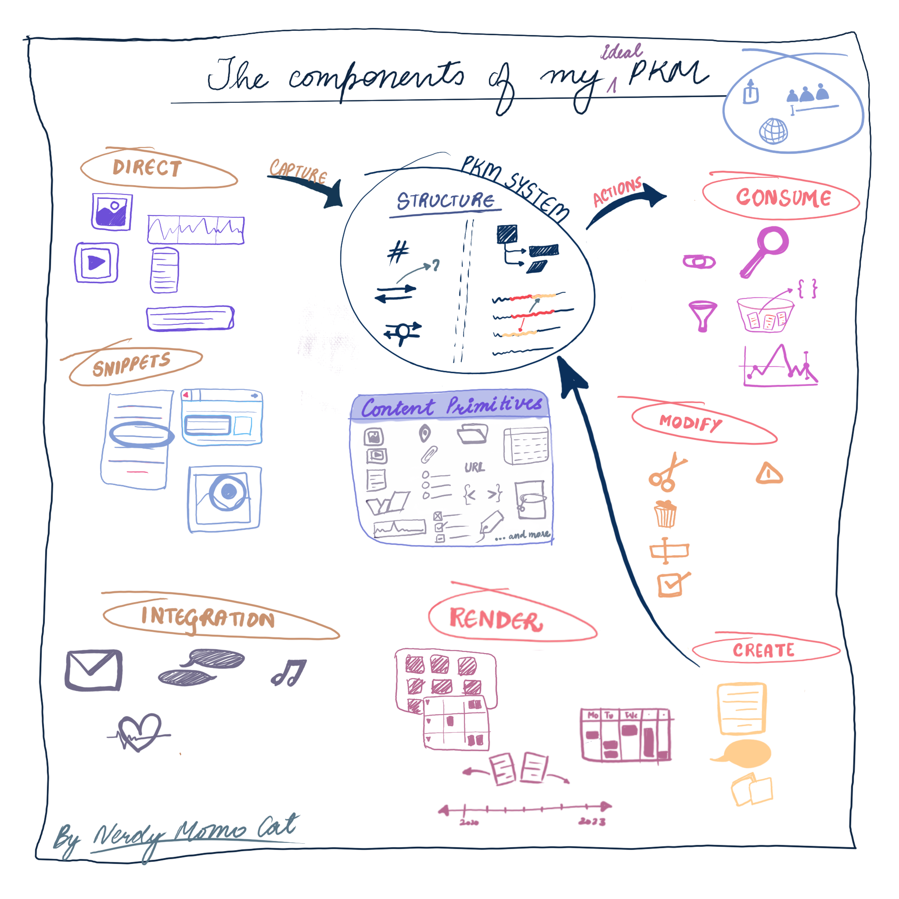
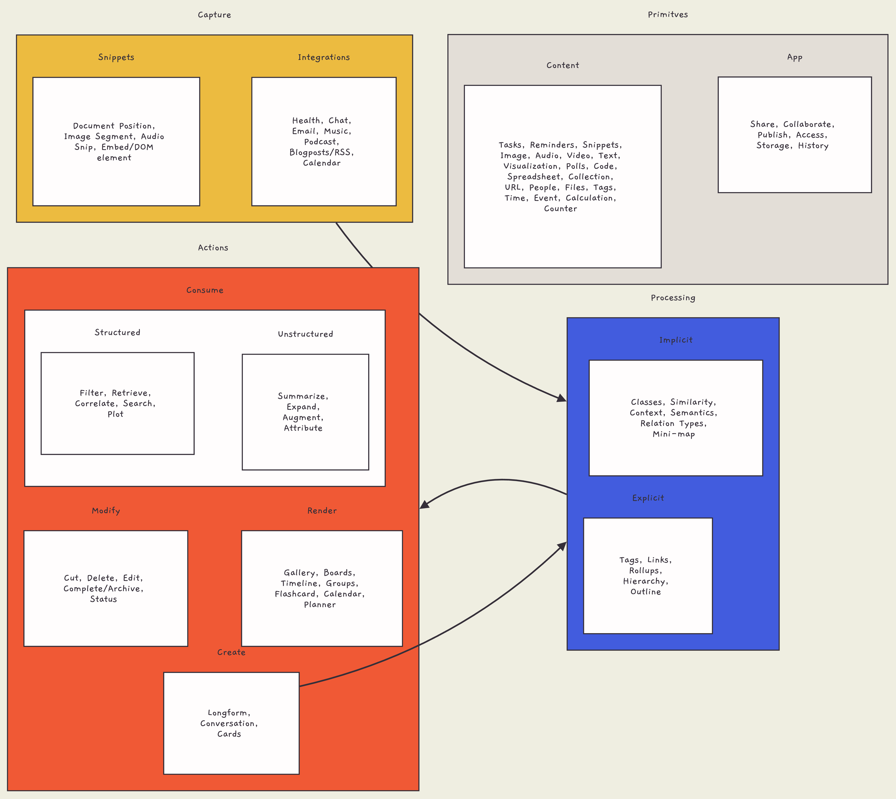

---
categories:
- PKM
- Note Taking
- AI
citation-location: margin
date: '2023-07-05'
description: 'Personal Knowledge Management (PKM) is the process of collecting, organizing, and making sense of knowledge. It involves using app and content primitives to manage information. Content creation leads to processing, and that guides the capture method. The processing cycle repeats further, culminating in actions.'
display-date: 'Jul 2023'
filters:
- collapse-social-embeds
- lightbox
format: html
lightbox: auto
reference-location: margin
threeword: 'PKM Components'
title: The Components of a Personal Knowledge Management
---

Hello, readers! Grab a cup of coffee, settle in, and join me today as we explore a fascinating world, the world of Personal Knowledge Management (PKM). And for those who sigh at the prospect of manual efforts, fear not, we'll also delve into the ways AI can serve as our digital butler, all set to ease our journey. Ready to dive in

# Understanding the PKM Primitives

Remember, every massive building begins with the laying of bricks? PKM also starts from seemingly mundane yet indispensable primitives. They are the building blocks, the foundation stones, shaping up the infrastructure where you collect, curate, organize, and eventually, make sense of your knowledge. Let\'s delve into their specifics.

## App Primitives

Imagine these as virtual rooms where you perform a plethora of tasks. These are places where you share interesting articles with your colleagues or access critical documents on the go. You collaborate on projects, publish your knowledge, store your bits and pieces of information safely, and even keep track of your changes on files or data.

## Content Primitives

From a task to be done, a reminder for a friend's birthday, to a fascinating code snippet you stumbled upon---these are the content primitives. They are the 'what' of your PKM: the kind of information you capture, hold, and process. Images, audio and visual clips, your next cooking recipe as text, or fun polls you conduct amongst friends---they all fall under this category.

# Unlocking Knowledge Through Processing

Second comes the turn of processing. This isn't just a tedious laundry-list compiling. It\'s you, as a goldsmith, refining the gold (content) by various processes explicit and implicit, before it\'s ready to be fashioned into ornaments (actions).

## Explicit Processing

Kudos to you, if you have ever put tags on your blog, created hyperlinks between your web pages, or constructed an outline for your report. You have already taken your first step in explicit processing. The joy of seeing related information clustered via tags, the context being built around a link, and the clarity achieved through outlines---all of them are rewards of this process.

## Implicit Processing with AI

Wanting to manage everything can be exhausting, especially with the constant stream of data. We need to lean on systems that can sift through this massive load in the background. Here\'s where artificial intelligence (AI) steps in. It\'s amazing how AI uses its magic to make sense of hidden patterns, extract meaning, find what\'s similar, and understand the underlying message.

The perks of AI are numerous. For example, AI can tag items or even enable auto-tagging by analyzing content thoroughly. Not only that, but AI can also identify links between different data and assist in creating related connections. It can even outline your content by understanding its structure. Basically, AI is your go-to tool, letting you concentrate on your main job, much like how a unique tool gives a hand to a jeweler.

Picture this: you\'re scrolling through your photos and find that they\'ve been grouped automatically due to similar characteristics. You\'d say, \"Cool, all my beach holiday snaps are in one place!\" This is how AI quietly does its work. It\'s as if there\'s a crew member behind-the-scenes, ensuring everything is spot-on while you wow your audience. It\'s like an AI-powered owl delivering your personal notes in the wide universe of information, a bit like how owls deliver mail in the Harry Potter series.

# The Art of Capture

Caught an interesting headline while scrolling through your news feed? Came across a golden nugget in a podcast? Want to save that hilarious meme from your chat? Capture comes in play in such instances where specific information pieces are to be grabbed and brought into your PKM system.

### Integrations

Linking your Personal Knowledge Management (PKM) system with a mix of resources like Health, Email, Blogposts/RSS, Music, and Calendar has the power to change how you handle information. This process is made more effortless, aware, and auto-set when you integrate an AI assistant, leading to higher effectiveness and simplicity.

Let\'s take health data connected to your PKM system, for instance. By tapping into AI, your assistant can monitor trends in your health data - factors like exercise, sleep, or nutrition. Using this context, the assistant can bring up tailor-made reminders and tips to maintain healthy habits, contributing to your wellness.

The integration of your PKM system with your email, blog posts, RSS feeds, music, and calendar brings more advantages. Picture your AI assistant going through your emails and pulling out critical information like deadlines, meeting summaries, or tasks automatically. This info can then be classified and arranged in your PKM system, allowing you to find and access it when necessary. Furthermore, integrating your PKM system with blogposts, RSS feeds, and other content can mean your AI assistant can fetch information important to you based on your taste and preferences.

### Snippets

Consider snippets as your pocket assistants for personal knowledge management. Think of them as the tools in your digital toolbox, each tailored to different mediums like images, text from documents or webpages, or even audio files - not unlike the varied knickknacks you might stow away in a physical scrapbook. Have you ever found yourself staring at a bursting-at-the-seams document or a webpage, trying to engulf information that seems akin to drinking from a firehose? Here\'s where snippets, those lifesavers, swoop in. Imagine how much easier it is to have just the sections that piqued your interest neatly tucked away in your PKM system, like a beaver selecting the best sticks for its dam.

Now let\'s take a quick detour from words to pictures. Are you engaged in some serious visual research or simply getting lost in an enchanting photo album? Snippets allow you to cherry-pick those parts of images that appeal to you the most, whether it\'s quirky street art, a picturesque sunset, or a helpful data visualization. File these snippets away into your PKM toolbox, and use them as visual cues that you can pull out when you need a memory jog. And don\'t forget about audio - maybe you\'re attending an insightful lecture or interviewing someone. Snippets let you skim the cream off these levels of audial rivers, turning lengthy recordings into digestible morsels of wisdom. Thus, in the world of PKM, snippets become your invaluable companions in carving a path through the informational jungle.

# Actions - The Grand Finale {#actions-the-grand-finale}

Finally, moving onto actions! Remember the gold extracted and refined? It\'s time to make it into ornaments now. Actions, thus, shape your processed knowledge into structures like galleries, cards, timelines, or boards, or processes such as searching, plotting, or filtering. Actions also contain modifications in your content, like cutting, deletion, editing, or status change.

## Render

Picture your personal knowledge management as a vibrant ecosystem of visual and interactive structures, brimming with galleries, boards, timelines, groups, and flashcards. They\'re like hidden treasure chests, each brimming with knowledge curated for easy comprehension and interaction. Galleries are your personalized exhibition spaces, housing your carefully chosen images, diagrams, or other multimedia content in a way that\'s pleasing to the eye and the mind. Boards resemble your very own brainstorming hub, allowing you to arrange different nuggets of knowledge, be it cards, notes, or snippets, mimicking the organic process of pinning ideas on a bulletin board.

Now, imagine seamlessly sifting through the linear thread of time with the help of timelines, enjoying the clarity they bring to your sequences and progressions. Lean into the beauty of groups and the sense of ordered coherence they lend to your thematic collections. Embrace the compact efficiency of flashcards for their strength in breaking down chunks of information into digestible, enthusiastic bouts of self-learning. As your weave this tapestry of knowledge structure, artificial intelligence plays a crucial role as your behind-the-scenes co-designer. Whether it\'s crafting engaging timelines or devising strategic flashcards, AI is your trusted aide, helping you chart your knowledge journey with an artist\'s finesse.

## Modify

Modification actions are essentially changes applied to your content - it could be as simple as editing a typo or deleting an unnecessary file. They could also be higher-level actions, such as marking a task complete or archiving an old document.

With AI working in tandem, you have an additional pair of eagle eyes. AI functionalities can catch your grammatical errors while editing, suggest deletions based on redundancy checks, auto-archive your completed tasks, and even monitor and manage the status of ongoing projects. It\'s akin to bringing in a scrupulous editor who has an eye for both macro-level content refinement and micro-level textual details.

## Create

Broad in its opportunities for creative content generation, a Personal Knowledge Management (PKM) system is an immersive platform propelling both complexity and simplicity. It\'s where users can cultivate long-form content like extensive reports or articles, dissecting intricate subjects and sharing deep insights. Imbued with rich text formatting, media embedding, and organizational elements, these systems shape the process of knowledge crafting into an art. After leveraging the refining and editing powers of PKMs, users can present their masterpieces to their network with confidence.

Not just a haven for extensive content, PKMs are also effective for creating concise cards or notes. Users can swiftly catalog key concepts or ideas in custom or predefined formats, employing tagging or labeling for efficient search and retrieval. It\'s a boon for summarizing knowledge or dispensing crisp, insightful snippets. But PKMs aren\'t just about solo journeys; they serve the social facet of learning by transforming into interactive platforms. Discussion forums or knowledge-sharing communities thrive here, nurturing enriching exchanges of thoughts and ideas. Finally, a PKM system transcends the textual realm, inviting multimedia expressions for delivering content, such as infographics or presentations. Users can harness integrated tools or external media to create engaging and richly informative visual narratives, thus reaching audiences in novel, captivating ways.

## Consume

### Structured

Structured consumption involves strategizing ways to gather and understand acquired knowledge. We filter to navigate through information overload, retrieve to find specific details, correlate to find relationships, search to unearth relevant facets and plot to graphically display information.

AI can shine a guiding light here. Using AI, you can efficiently filter through vast datasets based on your criteria, find correlations between audio tracks based on beats or rhythm, search through unstructured data for semantic meaning, or plot complex data into understandable graphs. It\'s akin to having an intelligent search dog that sniffs out exactly what you\'re looking for, saving you the time and effort of manual searching.

### Unstructured

Unstructured consumption is also about absorbing information, but this time, in raw, unformatted, and typically more extensive data sets. We summarize vast texts, expand on bullet ideas, augment information with additional context, or attribute missing metadata.

Enter, AI. AI could scan a massive document and give you a tight summary. It can expand on your bullet points to a full-fledged article, suggest augmentations based on trends or previous data, or fill in missing attributes in your music playlist based on genres or artists. It\'s like having a personal librarian who not only knows every book but also can summarize them.

# Conclusion

And it\'s a wrap! As we\'ve braved the journey together, hopefully, the foggy landscape of PKM seems clearer now. And with AI, it seems less daunting than exciting. However, remember that we discussed the components of a PKM system and how AI can be the wizard\'s apprentice making the process smoother. But as always, the wizard is still you.

*Content creation* leads to *processing*, and that guides the *capture* method. The *processing* cycle repeats further, culminating in *actions*.

# tl;dr {#tl-dr}

Personal Knowledge Management (PKM) is the process of collecting, organizing, and making sense of knowledge. It involves using app and content primitives to manage information. Processing knowledge includes explicit actions like tagging and linking, as well as implicit actions using AI to analyze and understand patterns. Capture involves grabbing specific information and integrating various resources. Snippets are useful tools for capturing different types of media. Actions shape processed knowledge into structures and modify content. Render actions create visual and interactive structures, while modify actions make changes to content. Create actions involve generating creative content, and consume actions involve filtering, searching, and summarizing knowledge. AI can assist in these actions by providing suggestions and automating tasks.
