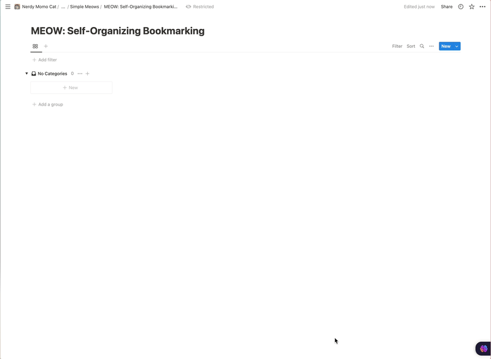

#### Why?

I hate having to tag everything in any Bookmark Manager, and an extra step of processing is just too much for my ADHD mind to get to.

That leads to inbox with 200+ entries.

And hence, this automation.

#### How?

What does it do?

##### Extracts content of the page

Checks if the content loading is not hindered due to javascript

##### Takes screenshot of the page using [Screenia](https://www.screenia.best/) by @s_badaoui

If it could not get the content of the page before, then uses ocr on image

##### Call OpenAI API 
It receives a JSON consisting of summary, tags and categories (chooses from a pre-selected list).

##### Add screenshot to dropbox 
And then get URL of the uploaded image.

##### Parses the information
And adds everything to notion.

#### Run this on your own

If you want to run this on your own, you need:

1. iOS/MacOS (because this is dependent on shortcuts app)

2. [Notion Integration Key](https://www.notion.so/help/create-integrations-with-the-notion-api)

3. Bookmarks Database duplicated from the link below, shared with integration and then get its database ID

4. [Open AI API Key](https://help.openai.com/en/articles/4936850-where-do-i-find-my-secret-api-key)

5. Free [Actions app](https://apps.apple.com/us/app/actions/id1586435171) by @sindresorhus [On both MacOS and iOS]

6. Connect your dropbox account in shortcuts (should hopefully prompt itself)

Issues:

1. It takes time to run this (and so you will see a spinner if you run this on ios, macos is in background, just don't add 2 bookmarks in under a minute)

2. Screenia has a rate limit and you can run into it.

3. iOS will ask god-awful permissions each damn time.

And finally, get the Apple Shortcut [here](https://nerdymomocat-shortened-url.vercel.app/self_organizing_bookmarks_shortcuts).

If you do end up using this, I would really appreciate if you could contribute to my wishlist or buy me a coffee.